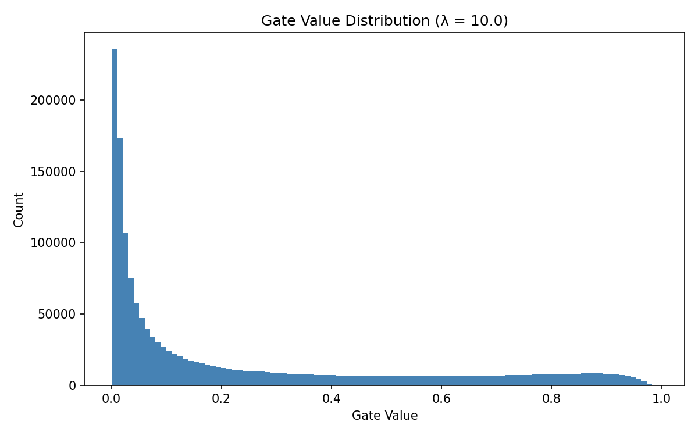

# Self-Pruning Neural Network Report

## Explanation

The model uses sigmoid gates on each weight. Sigmoid outputs values between 0 and 1.

The sparsity loss is the mean of all gate values. Minimizing it pushes gates toward 0.

When a gate is near 0, it multiplies the weight by ~0, so the weight has no effect. This removes it from the network.

The network learns to keep gates open only for useful weights. Useless weights get their gates closed. This is how it prunes itself during training.

## Results

| Lambda | Accuracy (%) | Sparsity (%) |
|--------|-------------|--------------|
| 0.0    | 51.91       | 0.00         |
| 1.0    | 52.27       | 1.92         |
| 5.0    | 53.12       | 28.48        |
| 10.0   | 53.07       | 52.31        |

## Analysis

With lambda = 0, there is no sparsity penalty. All gates stay open. No pruning happens.

As lambda increases, the penalty pushes more gates toward 0. Sparsity goes up.

At lambda = 10.0, over half the weights are pruned. Accuracy is still 53.07%, almost identical to the baseline.

This is the most important result. The network removed 52% of its weights and lost almost no accuracy. Those weights were not contributing anything useful.

This shows the trade-off: higher lambda gives more pruning with little accuracy cost.

## Gate Distribution Plot

The plot shows gate values from the best model at lambda = 10.0.

The large spike near 0 shows that most gates were pushed close to zero by the sparsity loss. These weights are effectively pruned.

The distribution has a long tail toward 1.0. A small number of gates stayed open — these are the weights the network decided to keep.

There is no clean two-cluster split. Most gates are near 0, but some are spread across the full range. This is expected with a strong lambda — the penalty is aggressive enough to close most gates but the network still keeps some partially active connections.

## Conclusion

The model successfully prunes itself during training. No manual pruning was needed.

Higher lambda means more pruning. Lower lambda means the network stays dense.

At lambda = 10.0, the model reaches 52% sparsity with no meaningful accuracy drop. The method works.